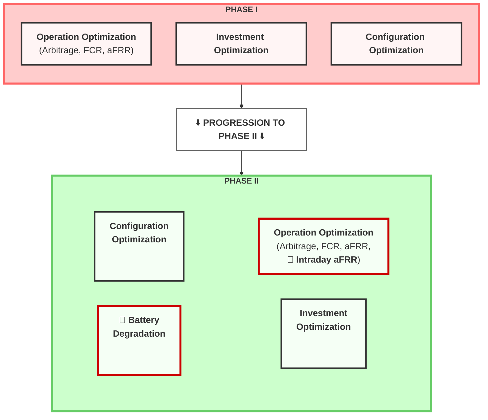

# Huawei TechArena 2025: BESS Energy Management System
*by Gen Li (Team SoloGen)*
*Last Update: Oct-27-2025*

> This INTERNAL document notes the overall project methodology, math models, development state.
> - **Repository Status:** Currently developing **Round 2 (Phase 2)** solution.
> - Phase 1 (2024 optimization) artifacts have been archived to `archive_old_files/`.
> - **New Data:** `data/TechArena2025_Phase2_data.xlsx`
> - **Active Branch:** `r2-with-bat-config`

A Python-based Energy Management System (EMS) for optimal Battery Energy Storage System (BESS) operations across multiple European electricity markets considering battery aging and degradation.

## Important Update 
  - [ ] Regarding the degradation model, it is essential that the battery operating period in all submissions is based on a fixed project lifetime of 10 years. While a 70% degradation limit can be considered a practical constraint, it ultimately depends on the specific degradation model each team applies. Consequently, this could lead to significant variations in the results and modeling approaches. 

Therefore, please do not include the end-of-life (EoL) degradation limit in your investment calculations. All investment-related analyses should assume a fixed 10-year operation period. 


## Table of Contents

---

## Context and Objectives
Primary objective: Develop a BESS to optimize financial performance by participating in four key markets: day-ahead (Energy), FCR (power capacity), and aFRR markets (both power and energy), while considering impact of BESS schedule on battery aging and degradation.

The challenge is divided into two phases, three core, interconnected optimization tasks:

### Phase I: One-Year Optimization without Battery Degradation
- **Operation Optimization:** Maximize the BESS's revenue over the year 2024 by developing an optimal charge/discharge strategy to bid in **three** markets: the DA, FCR and aFRR markets.

- **Investment Optimization:** Identify which of five European countries (Germany, Austria, Switzerland, Hungary, Czech Republic) offers the highest Return on Investment (ROI) for installing the BESS over a 10-year period.

- **Configuration Optimization:** Determine the optimal BESS configuration by analyzing the impact of different C-rates and daily cycle limits on profitability and performance.

#### Data for Investment and Configuration Optimization in Phase I
* Participants should still optimize the investment locations and configurations of BESS across the five given regions (DE, AT, CH, HU, CZ) as in Phase I.
  * The weighted-average cost of capital (WACC) remains as: **DE, AT, CH**: 8.3%; **CZ**: 12.0%; **HU**: 15.0%.
  * Inflation rate remains as: **DE**: 2.0%; **AT**: 3.3%; **CH**: 0.1%; **CZ**: 2.9%; **HU**: 4.6%.

* BESS Features remain as:  
  * **Nominal Energy Capacity**: 4472 kWh
  * **Power Rating**: 2236 kW
  * **Investment Cost**: 200 EUR/kWh
  * **(Dis-)Charging Efficiency**: `95% ?`
  * **Charge/Discharge C-Rates**: 0.25C, 0.33C, 0.50C
  * **Daily Number of Cycles**: 1.0, 1.5, 2.0
  * **Cooling Method**: Liquid Cooling


### Phase II: Phase 1 + Integration of Battery Degradation Modeling & aFRR Energy Market 

1. Include **the effect of battery degradation**. In other words, the operational strategy should aim to maximize battery lifetime.
    > - [ ] Comment by Gen: Shall this be optimized as a bi-objective problem, show optimal solutions in Pareto plots?
2. Integrate the **aFRR energy market** into the EMS algorithms for the operational perspective.




**Key Changes from Phase I to Phase II:**
- 🔴 **NEW**: Intraday aFRR market integration
- 🔴 **NEW**: Battery Degradation modeling and optimization
- ✅ **Continued**: Investment Optimization
- ✅ **Continued**: Configuration Optimization

#### Phase II Market Features Comparison

| Feature | Day-Ahead Market (EPEX SPOT) | FCR Capacity Market | aFRR Capacity Market | **(NEW)** aFRR Energy Market |
|---------|------------------------------|---------------------|----------------------|--------------------|
| **Mechanism** | Blind Auction | Daily Auction | Daily Auction | Continuous Merit Order Activation |
| **Gate Closure Time (D-1)** | 12:00 CET | 8:00 CET | 9:00 CET | 25 min before delivery (rolling) |
| **Product Granularity** | 15 minutes | 4 hours | 4 hours | 15 minutes |
| **Bid Structure** | Energy (MWh) | Symmetric Capacity (MW) | Asymmetric Capacity (MW) | Asymmetric Energy (MWh) |
| **Remuneration** | Pay-as-Cleared (Energy) | Pay-as-Cleared (Capacity) | Pay-as-Bid (Capacity) | Pay-as-Cleared (Energy) |
| **Minimum Bid Size** | 0.1 MW | 1 MW | 1 MW | 1 MW <br> *double-check if correct* |


#### Phase II Evaluation Criteria

| Evaluation Criteria | Ev. Weight | Description |
|---------------------|------------|-------------|
| **Revenue maximization** | 30% | This will evaluate how well the algorithm maximizes revenue based on market prices. |
| **BESS degradation**| 30% | This will evaluate the effect of charge/discharge optimal strategies on battery degradation. |
| **Investment optimization** | 10% | This will evaluate how well the optimal investment locations and markets are identified and assessed. |
| **Configuration optimization** | 10% | This criterion evaluates the analysis of key configuration parameters and their impact on BESS revenue. |
| **Code Quality and Documentation** | 20% | This will evaluate the clarity and structure of the code and deliverable documentation as well as the work presentation. |

> - [ ] Comment by Gen: Crucial to identify the **implementation priorities** of degradation factors: 
> 1. Which adds the largest marginal and which are small, and 
> 2. The complexity these factors add to the optimization model, if it worths including.

Following submission, each team’s battery operational profile will be analyzed using **the ORC Battery Degradation Model** to quantify the impact of their strategy on battery lifetime reduction.
  > - [ ] Comment by Gen: Crucial to study the ORC model and include it in the optimization process.

#### The Interdependence of the Four Optimization Tasks

A deeper analysis reveals a nested, hierarchical relationship between them that must be reflected in the project's modeling strategy.

The **"Optimal Configuration"** task is at the base of the hierarchy. The choice of a C-rate (0.5C, 0.33C, 0.25C) and a daily cycle limit (1.0, 1.5, 2.0) directly defines the physical constraints of the BESS, such as its maximum charge/discharge power and daily energy throughput. In addition, different C-rate and daily cycle limits, as well as SOC upper/lower bounds will also lead to different battery aging profiles. These parameters are fundamental inputs for the **"Optimal Operation"** model.

The **"Optimal Operation"** model forms the core of the analysis. It takes the configuration parameters as given and, based on market price data, calculates the maximum possible annual revenue for that specific BESS configuration in a given country. This revenue figure is the most critical output of the entire project. Furthermore, the operational strategy derived from this model directly influences battery degradation, which is a key consideration in Phase II.

Finally, the **"Optimal Investment"** task sits at the top of the hierarchy. It uses the annual revenue figures generated by the **"Optimal Operation"** model as its primary input to calculate the 10-year ROI. The optimal country for investment is simply the one that yields the highest ROI. This task synthesizes the outputs of the other two tasks to provide a comprehensive investment recommendation.


#### Battery Degradation: Why so important?
Battery degradation is a critical factor in the operation and management of Battery Energy Storage Systems (BESS). Over time, batteries lose their capacity to hold charge and their efficiency decreases due to various factors such as charge/discharge cycles, depth of discharge, temperature, and operational strategies.

The impact of aging model selection on battery revenue is significant. 
1. Using different aging models can substantially influence the optimal operating strategy of the battery. 
2. More complex aging cost models enable higher profits while maintaining similar SOH final impact[^1].


*Figure 1: Comparison of battery aging models showing the trade-off between revenue optimization and battery degradation. More sophisticated aging cost models can achieve higher profitability while maintaining similar final SOH values.*
> - [ ] Comment from Gen: It's crucial to understand this graph.


#### Major Factors Affecting Battery Degradation During Operation
- [ ] TODO: Prioritize Battery Degradation Factors by P1-P3 (P1 the highest)

| **Factor** | **Impact on Battery Degradation** |
|--------|-------------------------------|
| **Temperature** <br> >consider regional temperature variations across the five given regions. | • Both high and low temperatures accelerate different degradation modes.<br>• High temperature (>40 °C): Speeds up side reactions (e.g., SEI growth, electrolyte decomposition, gas formation) → capacity fade and internal resistance rise.<br>• Low temperature (<0 °C): Increases lithium plating on the anode during charging → irreversible lithium loss and safety risks.<br>• Thermal management is critical; degradation roughly doubles for every 10 °C increase (Arrhenius behavior). |
| `P1` **Charge/Discharge Rate (C-rate)** | • Higher C-rates accelerate degradation.<br>• In fast charging, lithium ions can't diffuse fast enough → lithium plating on the anode.<br>• High discharge rates cause increased internal heating, mechanical strain, and contact loss which causes reduced active material utilization and faster capacity fade. |
| `P1` **SoC Range** | • Operating at very high or very low SoC accelerates aging.<br>• High SoC (>90%): Cathode oxidation, transition metal dissolution, electrolyte oxidation.<br>• Low SoC (<10%): Copper dissolution from the anode current collector and deep lithiation damage.<br>• *Restriction of SoC window (e.g., 20–80%) can minimize structural and chemical stress.* |
| `p1` **Depth of Discharge** | • Larger DoD (e.g., 0–100%) shortens cycle life; shallow cycling (e.g., 20–80%) improves lifetime.<br>• Each cycle's voltage and strain swing cause mechanical and chemical stress on electrodes.<br>• High DoD → More electrode expansion/contraction → micro-cracks and SEI rupture → increased irreversible capacity loss. |
| **Battery Management System (BMS) Strategy** | • Directly influences lifetime by controlling operation conditions.<br>• Smart algorithms (SoC windowing, temperature regulation, current limits) can minimize stress; poor algorithms exacerbate it.<br>• Optimized BMS can double the usable life. |
| `P2` **Calendar Aging (Storage Conditions)** <br> - [ ] check this [aging aware MPC](https://gitlab.lrz.de/open-ees-ses/aging-aware-MPC) | • Even when not in use, batteries degrade over time.<br>• SEI thickening, electrolyte oxidation, and loss of cyclable lithium occur during storage, especially at high temperature and SoC.<br>• Degradation is faster at high SoC and high temperature — typically expressed as a function of (T, SoC). |

#### [Same data for Investment and Configuration Optimization as Phase I](#data-for-investment-and-configuration-optimization-in-phase-i)


#### Bonus: Challenge for real-time trading: Uncertain aFRR energy activation and revenue
* In reality, aFRR energy is activated on a 4-second level based on the cross-border marginal price (CBMP) computed in the PICASSO platform. 4-second CBMP prices are not provided by Huawei, but could be downloaded here: https://www.transnetbw.de/en/energy-market/ancillary-services/picasso 
* If you want to do considerations on 4-second prices, use data from TNG (TransnetBW TSO).


## Methodology Overview

- Data pipeline 
- Modelling (assumption, model used, and implementation method)
- Optimization (solver, parameters, and performance)
- Results and analysis, visualization approach
- Important finding, figures, pictures and Conclusion 

## Mathematical Model 

### Phase 2: Phase 1 + Battery Degradation Modeling

We extend the Phase I MILP (Base Model) by incorporating the aFRR Energy Market (model (i)) and replacing the rigid daily cycle limit with a flexible degradation cost function (model (ii)). In addition, calendar aging costs are introduced in model (iii). The following subsections detail these modifications. 

The complete math model can be found in `doc\p2_model\p2_bi_model_ggdp.tex`

## Investment Optimization

## Implementation Pipeline

### Model Statistics 
- **Variables**: ~`xxx`total (70,000 continuous + 35,000 binary)
- **Constraints**: ~`xxx` total (35K SOC dynamics + 105K market/power constraints)
- **Solve Time**: `xxx` minutes per scenario with `SolverName` (`??s` time limit)
- **Memory Usage**: ~`xxx` GB per optimization instance

## Model Validation 

### Validation Approach and Testing Scenarios

**Scenarios:**
  i) Scenario 1 (S1): Baseline without battery degradation
  ii) Scenario 2 (S2): Including battery degradation effects

1. T1: model behaviors in four markets in S1 (4 in total):
2. T2: model behaviors in four markets in S2 with different battery degradation profiles ($4N$ in total, where $N$ is the number of degradation profiles tested)


## Final Results and Analysis


## Sample Data 
The whole data set spans across the whole year of 2024 with 15-minute resolution for DA market and aFRR energy markets, and 4-hour resolution for FCR and aFRR capacity markets. Below we provide sample data snippets for each market.

### DA
Remark: For DA data, DE_LU column represents the joint Germany and Luxembourg market prices.

```json
[
  {
    "timestamp":"2024-01-01T00:00:00.000",
    "DE_LU":39.91,
    "AT":14.08,
    "CH":25.97,
    "HU":0.1,
    "CZ":0.1
  },
  {
    "timestamp":"2024-01-01T00:15:00.000",
    "DE_LU":-0.04,
    "AT":14.08,
    "CH":25.97,
    "HU":0.1,
    "CZ":0.1
  },
  {
    "timestamp":"2024-01-01T00:30:00.001",
    "DE_LU":-9.01,
    "AT":0.48,
    "CH":25.97,
    "HU":0.1,
    "CZ":0.1
  },
  {
    "timestamp":"2024-01-01T00:45:00.001",
    "DE_LU":-29.91,
    "AT":-3.64,
    "CH":25.97,
    "HU":0.1,
    "CZ":0.1
  }
]
```


### aFRR Energy
```json
[
  {
    "timestamp":"2024-01-01T00:00:00.000",
    "DE_Pos":50.3411486486,
    "DE_Neg":29.702029703,
    "AT_Pos":86.43,
    "AT_Neg":0.0,
    "CH_Pos":38.7,
    "CH_Neg":0.0,
    "HU_Pos":0.0,
    "HU_Neg":0.0,
    "CZ_Pos":144.0,
    "CZ_Neg":0.0
  },
  {
    "timestamp":"2024-01-01T00:15:00.000",
    "DE_Pos":46.9457142857,
    "DE_Neg":40.87125,
    "AT_Pos":85.25,
    "AT_Neg":0.17,
    "CH_Pos":38.8,
    "CH_Neg":8.32,
    "HU_Pos":0.0,
    "HU_Neg":0.6014018923,
    "CZ_Pos":117.26,
    "CZ_Neg":53.39
  },
  {
    "timestamp":"2024-01-01T00:30:00.001",
    "DE_Pos":43.8748717949,
    "DE_Neg":21.2391111111,
    "AT_Pos":85.44,
    "AT_Neg":0.73,
    "CH_Pos":38.76,
    "CH_Neg":0.0,
    "HU_Pos":0.0,
    "HU_Neg":1.1334522217,
    "CZ_Pos":140.84,
    "CZ_Neg":62.84
  }
]
```

### FCR
```json
[
  {
    "timestamp":"2024-01-01T00:00:00.000",
    "DE":114.8,
    "AT":114.8,
    "CH":114.8,
    "HU":3.1851080706,
    "CZ":416.0
  },
  {
    "timestamp":"2024-01-01T04:00:00.000",
    "DE":104.4,
    "AT":104.4,
    "CH":104.4,
    "HU":3.1851080706,
    "CZ":416.0
  },
  {
    "timestamp":"2024-01-01T08:00:00.001",
    "DE":68.8,
    "AT":68.8,
    "CH":68.8,
    "HU":3.1851080706,
    "CZ":416.0
  },
  {
    "timestamp":"2024-01-01T12:00:00.001",
    "DE":77.6,
    "AT":77.6,
    "CH":77.6,
    "HU":3.1851080706,
    "CZ":390.4
  }
]
```


### aFRR Capacity
```json
[
  {
    "timestamp":"2024-01-01T08:00:00.001",
    "DE_Pos":6.33,
    "DE_Neg":13.07,
    "AT_Pos":5.57,
    "AT_Neg":8.5,
    "CH_Pos":6.66,
    "CH_Neg":23.08,
    "HU_Pos":10.048546094,
    "HU_Neg":13.327884282,
    "CZ_Pos":29.1639497143,
    "CZ_Neg":10.6757588259
  },
  {
    "timestamp":"2024-01-01T12:00:00.001",
    "DE_Pos":4.12,
    "DE_Neg":15.02,
    "AT_Pos":3.56,
    "AT_Neg":9.52,
    "CH_Pos":4.41,
    "CH_Neg":20.63,
    "HU_Pos":0.0,
    "HU_Neg":0.0,
    "CZ_Pos":23.342256,
    "CZ_Neg":4.1489131297
  },
]
```

### Technical Description: "Scaled and Discounted" Aging Cost (Collath et al. - Section 3.4)

This describes an advanced optimization technique designed to maximize the Net Present Value (NPV) of a BESS, rather than just the total cumulative profit. It consists of two independent but complementary parts: "Scaling" and "Discounting".

**1. "Scaled" Aging Model (The Baseline)**

* **Problem:** The "Non-scaled" (or "fully accurate") degradation model  exhibits a sublinear dependency on time (e.g., $\sqrt{t}$). This results in prohibitively high aging costs in the early years of operation when the battery is new.
* **Behavioral Consequence:** This high initial cost forces the optimizer to be overly conservative, forgoing valuable early-life profit opportunities. This leads to a sub-optimal lifetime NPV.
* **"Scaled" Solution:** This approach linearizes the degradation model at a *fixed* point, representing a mid-life aging state ($Q^{loss,cal}=5\%$ and $Q^{loss,cyc}=5\%$), and uses this *same* linearization for the *entire* BESS lifetime.
* **Result:** The optimizer perceives a moderate, consistent aging cost from Year 1. This encourages more consistent profit generation across the lifetime and results in a significantly higher NPV (340.3 EUR/kWh) compared to the "Non-scaled" model (291.9 EUR/kWh).

**2. "Discounted" Aging Model (The NPV-aware Enhancement)**

* **Goal:** To further optimize for NPV, this technique "front-loads" profits by internalizing the time value of money (as defined by the interest rate $i$) directly into the optimizer's cost function.
* **Mechanism:** The aging cost parameter $c^{aging}$ (in EUR/kWh) is no longer treated as a constant. It is made time-dependent by applying the discount rate in reverse, as defined in **Equation (28)**:

    $$c^{aging^{\prime}} = c^{aging} \cdot (1+i)^{m}$$

* **Variable Definitions:**
    * $c^{aging^{\prime}}$: The new, time-varying aging cost used by the optimizer.
    * $c^{aging}$: The original, "optimal" constant aging cost (the tuning parameter).
    * $i$: The interest rate used for the project's financial evaluation.
    * $m$: The current fractional year of operation since the start of the simulation.

* **Impact on Optimization:**
    * In the early years ($m \approx 0$), the optimizer sees a *low* aging cost ($c^{aging^{\prime}} \approx c^{aging}$). This incentivizes more aggressive cycling to capture immediate profit.
    * In the later years ($m$ is large), the optimizer sees an *exponentially higher* aging cost ($c^{aging^{\prime}} \gg c^{aging}$), which strongly disincentivizes cycling as the perceived cost outweighs the potential profit.

* **Final Outcome:** This strategy intentionally shifts profit generation from the less valuable later years to the highly valuable early years. This results in the highest possible NPV (346.6 EUR/kWh) of all strategies, even if the total cumulative *undiscounted* profit (551.1 EUR/kWh) is slightly lower than the standard "Scaled" model (574.2 EUR/kWh).


___


## Bibliography
[^1]: Collath, Nils, et al. "Increasing the lifetime profitability of battery energy storage systems through aging aware operation." *Applied Energy* 348 (2023): 121531.
